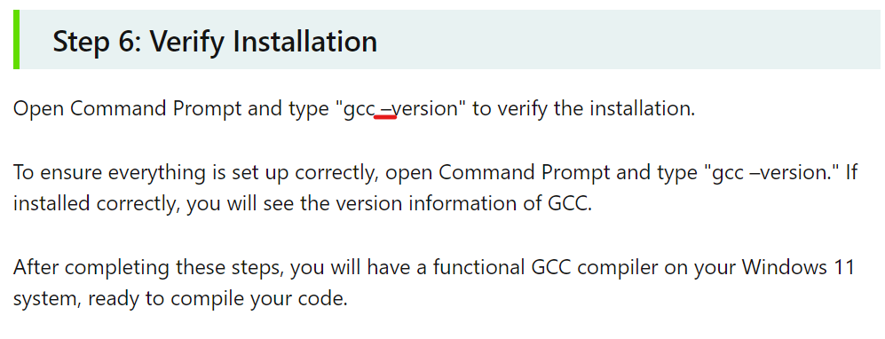
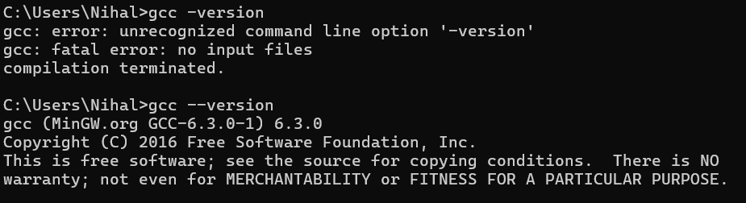

# Formula Student-RaceUP-E Recruitment Task 
Optional recruitement task for software department at RaceUP-e 

## Rules 
* Don’t change integrity_check_db.h and integrity_check_db.c files.
* Comments that explain what you are doing and your way of thinking are
 very welcomed
* NO OTHER EXTERNAL LIBRARIES ALLOWED

## Getting Started

## Functionality & Debugging

## Design Decisions 

## Recommendations to the main task
- Clear decleration in the task of the version of MinGW to be consumed, and link provided to the setup tool as well with the guide
- Wrong command mentioned in the guide for version check, can be mentioned in future recruitment tasks, if ever required again. 

## Future Improvements
